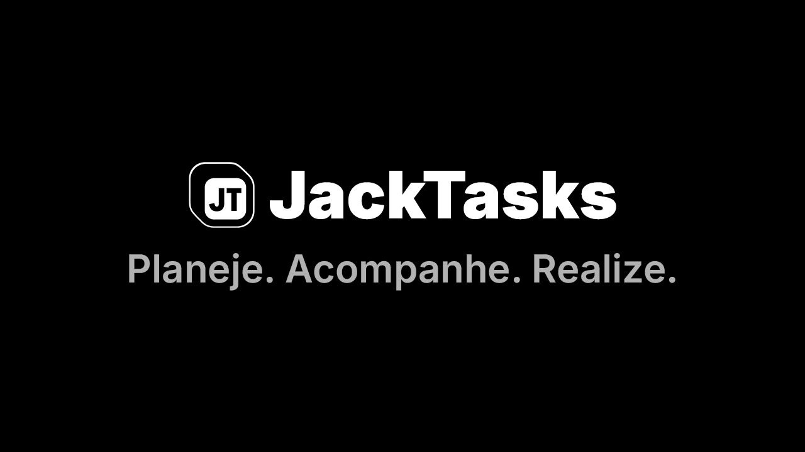

<div align="center">

# JackTasks

Uma aplicação completa de gerenciamento de tarefas com backend robusto e frontend moderno.



|  |  |  |  |  |  |  |  |  |
|:---:|:---:|:---:|:---:|:---:|:---:|:---:|:---:|:---:|
| Node.js | Express | TypeScript | MySQL | JWT | React | Tailwind CSS | Vite | Framer Motion |

</div>

## Visão Geral

O projeto é dividido em duas partes principais:

- [Backend](./backend/README.md): API construída com Node.js, Express e MySQL.
- [Frontend](./frontend/README.md): UI desenvolvida com React e TypeScript.

## Principais Funcionalidades

- Autenticação de usuários com JWT
- Criação, leitura, atualização e exclusão de tarefas
- Visualização de tarefas em formato de lista e calendário
- Métricas e análises de produtividade
- Interface responsiva e moderna com suporte a tema claro e escuro

## Como Iniciar

1. Clone o repositório:
   ```
   git clone https://github.com/detalhe/jacktasks.git
   cd jacktasks
   ```

2. Configure o Backend:
   ```
   cd backend
   npm install
   # Configure as variáveis de ambiente no arquivo .env
   npm run dev
   ```

3. Configure o Frontend:
   ```
   cd ../frontend
   npm install
   npm run dev
   ```

4. Acesse a aplicação em `http://localhost:5173`

## Documentação Detalhada

Para informações mais detalhadas sobre cada parte do projeto, consulte os READMEs específicos:

- [Documentação do Backend](./backend/README.md)
- [Documentação do Frontend](./frontend/README.md)
